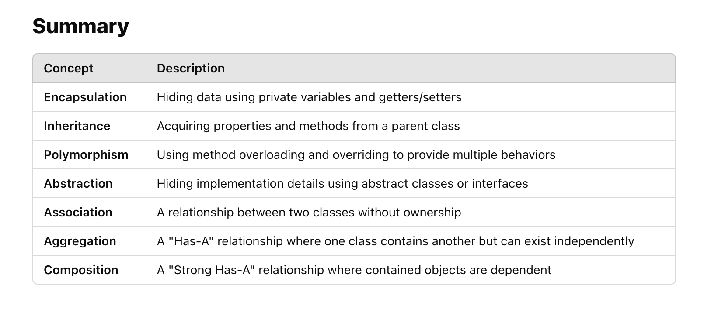

**Java OOPs (Object-Oriented Programming) Concepts**

Java is an object-oriented programming (OOP) language that follows fundamental OOP principles. The four main pillars of OOP in Java are:
>1. Encapsulation (Data Hiding)
>2. Inheritance (Code Reusability)
>3. Polymorphism (Multiple Forms)
>4. Abstraction (Hiding Implementation)

**Other Important OOP Concepts**
>5. Association  
   Defines a relationship between two classes (without ownership).
   Example: A Teacher can be associated with multiple Students, but they exist independently.
>
>6. Aggregation  
   A "Has-A" relationship, where one class owns another class.
   Example: A Department has Teachers, but if the department is deleted, teachers can exist.
>7. Composition  
> Strong ownership: If the owner is deleted, the dependent object is also deleted.  
> Example: A Car has an Engine. If the Car is destroyed, the Engine is also removed.!

